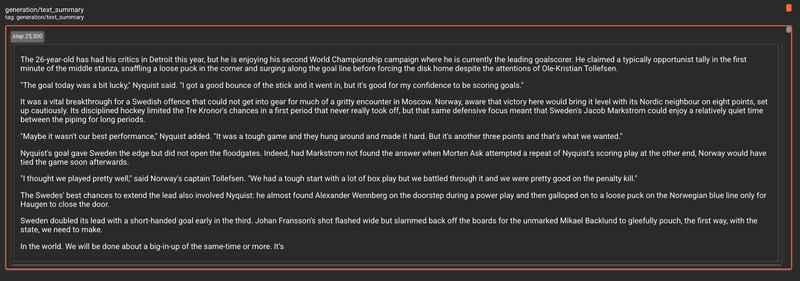
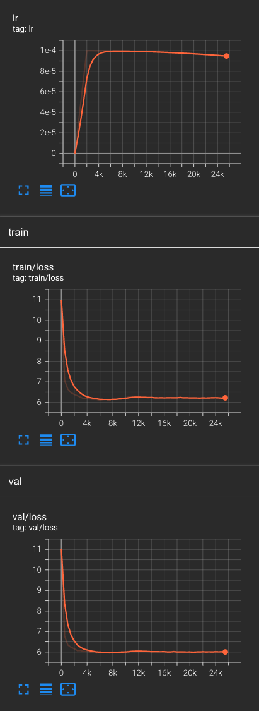
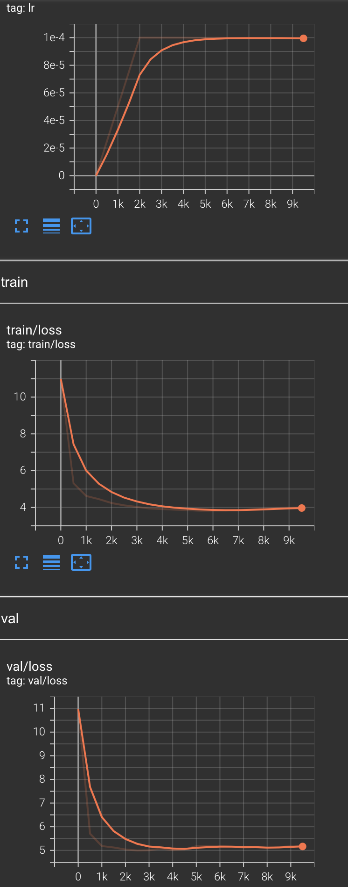

# jax-nanoGPT

A replicate [nano-GPT](https://github.com/karpathy/nanoGPT) in JAX.

## Install

Install dependencies

```bash
pip install -r requirements.txt
```

If you want to use this code with TPUs, install:

```bash
pip install "jax[tpu]>=0.2.16" -f https://storage.googleapis.com/jax-releases/libtpu_releases.html
```

## Train

To create a dataset run:

```bash
cd data/shakespeare
python prepare.py
```

This will create a train.bin and val.bin which holds GPT2 BPE token ids in one sequence. Now you can train. Go back to the folder with the training script and run.

```bash
python train.py --config shakespeare
```

## Generate

To generate text, use the `generate.py` script with the config that was used for training and the last checkpoint step that was saved.

```bash
python generate.py --config shakespeare --checkpoint-step 7500
```

Tensorboard logs will be stored in out-{dataset-name} with train/eval loss, learning rate and sampled generations.

## Examples

Training with openwebtext10k dataset for 25k steps, where the last 50 characters in the text are generated.

<p align="center">
    </img>
    </img>
</br>
</br>
<p align="center">Training with the shakespeare dataset for 9600 steps.</p>
<p align="center">
    </img>
</p>